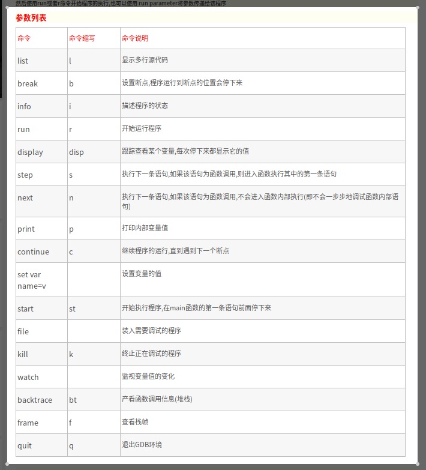

---

typora-copy-images-to: images
typora-root-url: ./
---

layout: post_layout
title: 学会像计算机一样思考，了解计算机操作系统以及编程语言工作原理
time: 2019年08月16日 星期五
location: 上海
pulished: true
excerpt_separator: "```"
typora-root-url: images

1. 观看视频《Linux C语言编程基本原理与实践》：https://www.imooc.com/learn/248
2. 观看视频《Linux C语言指针与内存》：https://www.imooc.com/learn/394

- 编译文件：gcc  文件名

  - gcc -c 文件名 -o 编译后文件名（-c不含有main（）函数）
  - gcc main.c -o main.out && ./main.out

- 多文件

  - main函数所在文件需声名：#include "head.c"
  - 编译：gcc hello.c

- 头文件与函数分离

  - hello.c

    - #include <stdio.h>
      #Include "max.h"
      int main(){ 
      int a;
      a=max();

      }

  - max .c

    - int max(){}

  - max.h

    - int max(int a ,int b);       

  - make用法：

    - 建立Makefile文件
      - 声名# this is a make file
      - hello.out:max.o hello.c
        gcc max.o hello.c
      - max.o:max.c 
        gcc -c max.c
    - make

- echo $？通过返回值判断是否成功

- int main(int argv,char* argc[]){}   argv表示输入的数量，argc[]后面是放入数组。

- stdout \stdin\stderr      fpirntf 和fscanf

- 输入流   >   和输出流   <  

  - 》添加输入 >覆盖输入

- 管道： | 

  - |符号前面是要输入的数据流，|后面是接受数据流的函数。

- 练习使用GDB进行代码测试，通过代码测试了解指针在内存中的作用。

  - GDB代码
  
  